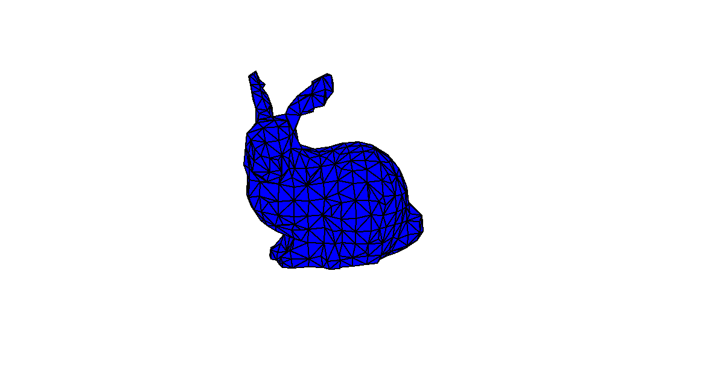

# 3D-Engine

This is a lightweight proof-of-concept 3D engine written entirely in Python. It uses only the built-in `math` library and `PyQt5` for rendering and interaction. The engine supports loading `.ply` (Polygon File Format) models and visualizing them in a custom-built 3D viewer.



## ✨ Features:

* Load and render polygonal `.ply` models
* 3D visualization using PyQt5 (no OpenGL or external 3D libraries)
* Basic camera movement and model interaction

## 🎮 Controls:

* **Arrow Up / Down**: Move the object vertically
* **W / A / S / D / Q / E**: Rotate the object along different axes

## 🔧 How to Use:

In `main.py`, specify the PLY file path in line 47:

```python
# Select the PLY Data  
self.polygone = load_poly('ply_data/bunny/bun_zipper_res4.ply')
```

This project is purely educational and demonstrates how to build a simple 3D engine using only core Python tools and PyQt5 for GUI rendering.
